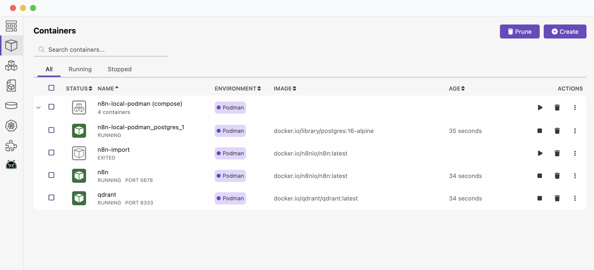

# n8n-local-podman

A quick repo for self-hosting n8n using Podman instead of Docker.

## PostgreSQL 

You must specify POSTGRES_PASSWORD to a non-empty value for the superuser.

```zsh
n8n-local-podman % vi ~/.zshrc

# n8n.io PostGres
export POSTGRES_USER=n8n
export POSTGRES_PASSWORD=n8npassword
```

And don't forget `source ~/.zshrc` to update current terminal.

## Podman Install

Start here: https://podman.io/docs/installation#macos

Podman can be downloaded from the [Podman.io](https://podman.io/) website.

After installing, you need to create and start your first Podman machine:

```zsh
n8n-local-podman % podman machine init
n8n-local-podman % podman machine start
```

You can then verify the installation information using:

```zsh
n8n-local-podman % podman info
```

### Podman Compose

To install **Podman Compose** using pip3, follow these steps:

```zsh
n8n-local-podman % pip3 install podman-compose
```

After installation, try running:

```zsh
n8n-local-podman % podman-compose --version

podman-compose version 1.3.0
podman version 5.4.0
```

### Podman Desktop

You can find `Podman Desktop` here: https://podman-desktop.io/downloads

## Ollama

Visit the [Ollama download](https://ollama.com/download/mac) page, and click on the `Download for macOS` button.


```zsh
ollama run llama3
```

The first time you run this command, it will download the latest version of the model.

```zsh
ollama list

NAME                       ID              SIZE      MODIFIED       
llama3:latest              365c0bd3c000    4.7 GB    42 seconds ago 
```

If you are looking to run `DeepSeek R1` on Ollama on MacOS:

```zsh
ollama run deepseek-r1:1.5b
```

### OLLAMA_HOST

Since we are going to run Ollama on our host machine, outside the Podman container, we need to
use a special DNS name (`host.docker.internal`) used by Docker to allow containers to communicate with the host machine.
It resolves to the internal IP address of the host, making services on the host accessible from within containers.

In our `podman-compose.yaml` we need to set `- OLLAMA_HOST=host.docker.internal:11434`.

```yaml
x-n8n: &service-n8n
  image: docker.io/n8nio/n8n:latest
  networks: ['demo']
  environment:
    ...
    - OLLAMA_HOST=host.docker.internal:11434
  volumes:
    - n8n_storage:/home/node/.n8n
```

> NOTE: To actually run Ollama in a container using `podman-compose.yaml`, you would need to:
>
> 1. Choose the appropriate profile (CPU or GPU) when starting the services.
> 2. Ensure the host machine has Ollama running and accessible at the specified `OLLAMA_HOST=ollama:11434` address.
> 3. Modify the compose file to remove the host-specific networking if you want Ollama to run entirely within the container environment.

## Launch N8N

Run the following command to start n8n:

```zsh
n8n-local-podman % podman-compose -f podman-compose.yaml up -d
```

This will start the n8n container in detached mode. See the containers in Podman Desktop:



Access `n8n` by opening your web browser and navigating to http://localhost:5678.
You'll be prompted to log in using the credentials specified in the environment variables.

```zsh
n8n-local-podman % podman ps
CONTAINER ID  IMAGE                                 COMMAND          CREATED        STATUS        PORTS                             NAMES
81a80c9220e4  docker.io/library/postgres:16-alpine  postgres         3 minutes ago  Up 3 minutes  5432/tcp                          podman_postgres_1
81d81b63266a  docker.io/n8nio/n8n:latest                             3 minutes ago  Up 3 minutes  0.0.0.0:5678->5678/tcp            n8n
b354510fa908  docker.io/qdrant/qdrant:latest        ./entrypoint.sh  3 minutes ago  Up 3 minutes  0.0.0.0:6333->6333/tcp, 6334/tcp  qdrant
```

To stop the containers started with podman-compose, you can use the following command:

```zsh
n8n-local-podman % podman-compose -f podman-compose.yaml down
```

This command will stop and remove all the containers defined in your `podman-compose.yaml` file. The `-f` flag specifies
the compose file to use, ensuring it uses the same file you used to start the containers.

If you want to stop the containers without removing them, you can use:

```zsh
n8n-local-podman % podman-compose -f podman-compose.yaml stop
```

This will stop the containers but keep them in a stopped state, allowing you to start them again later without
recreating them.

> **NOTE: `n8n` is running in Podman, not Docker.**
> 
> Podman is designed to be a drop-in replacement for Docker, which is why the output looks very similar to what you'd see with Docker.
>
> The presence of containers running `PostgreSQL`, `n8n`, and `Qdrant` indicates that you're using a container runtime,
> and since you used the podman ps command, that runtime is Podman. Podman is managing these containers, including the n8n container (container ID: 81d81b63266a).
>
> It's worth noting that Podman can use Docker images (as indicated by the `docker.io/` prefix in the image names)
> because it's compatible with the OCI (Open Container Initiative) standards, which both Docker and Podman adhere to.
