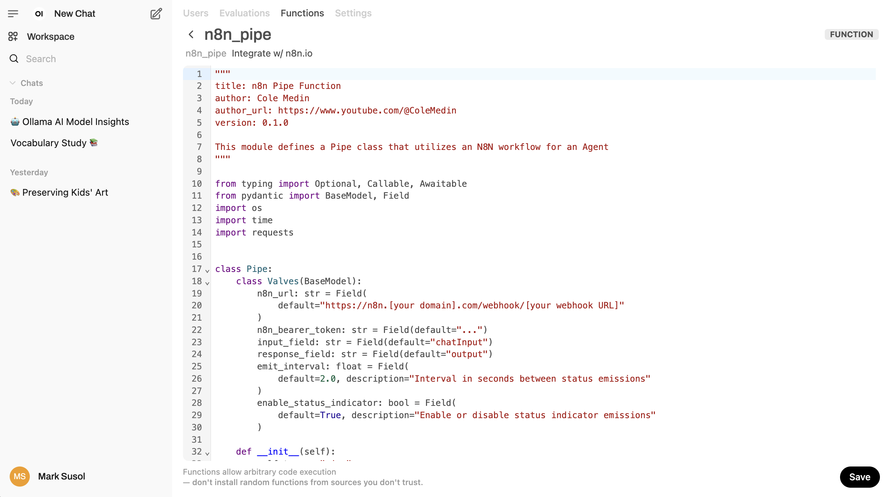

# n8n-local-podman

A quick repo for self-hosting n8n using Podman instead of Docker.

**Architectural Overview of the Integrated System.**

The integrated system comprises five core components operating within a Podman Compose environment:

1.	n8n (v1.44+): Workflow automation platform for creating AI agents
2.	Open Web UI (v0.7+): Frontend interface with voice chat capabilities
3.	Ollama (v0.1.36+): Local LLM execution engine
4.	Quadrant (v1.2+): Vector database for RAG implementations
5.	Postgres (v16+): Relational database for chat history storage
6.	pgAdmin (v4+): Web-based PostgreSQL administration tool

The architecture enables bidirectional communication where Open Web UI sends user queries to n8n workflows via webhooks,
while n8n processes requests using local LLMs and returns responses through the same interface.

> **NOTE:** I make no apologies for optimizing this local integrated system only for **MacBooks Pro w/M3**.

## PostgreSQL 

You must specify POSTGRES_PASSWORD to a non-empty value for the superuser.

```zsh
% vi ~/.zshrc

# n8n.io PostGres
export POSTGRES_USER=n8n
export POSTGRES_PASSWORD=n8npassword
```

And don't forget `source ~/.zshrc` to update current terminal.

### pgAdmin

Access pgAdmin through a web browser at http://localhost:9876

## Podman Install

Start here: https://podman.io/docs/installation#macos

Podman can be downloaded from the [Podman.io](https://podman.io/) website.

After installing, you need to create and start your first Podman machine:

```zsh
% podman machine init
% podman machine start
```

You can then verify the installation information using:

```zsh
% podman info
```

### Podman Compose

To install **Podman Compose** using pip3, follow these steps:

```zsh
% pip3 install podman-compose
```

After installation, try running:

```zsh
% podman-compose --version

podman-compose version 1.3.0
podman version 5.4.0
```

### Podman Desktop

You can find `Podman Desktop` here: https://podman-desktop.io/downloads

## Ollama

Visit the [Ollama download](https://ollama.com/download/mac) page, and click on the `Download for macOS` button.

```zsh
ollama run llama3
```

The first time you run this command, it will download the latest version of the model.

```zsh
ollama list

NAME                       ID              SIZE      MODIFIED       
llama3:latest              365c0bd3c000    4.7 GB    42 seconds ago 
```

If you are looking to run `DeepSeek R1` on Ollama on MacOS:

```zsh
ollama run deepseek-r1:1.5b
```

### OLLAMA_HOST

Since we are going to run Ollama on our host machine, outside the Podman container, we need to
use a special DNS name (`host.docker.internal`) used by Docker to allow containers to communicate with the host machine.
It resolves to the internal IP address of the host, making services on the host accessible from within containers.

In our `podman-compose.yaml` we need to set `- OLLAMA_HOST=host.docker.internal:11434`.

```yaml
x-n8n: &service-n8n
  image: docker.io/n8nio/n8n:latest
  networks: ['demo']
  environment:
    ...
    - OLLAMA_HOST=host.docker.internal:11434
  volumes:
    - n8n_storage:/home/node/.n8n
```

> NOTE: To actually run Ollama in a container using `podman-compose.yaml`, you would need to:
>
> 1. Choose the appropriate profile (CPU or GPU) when starting the services.
> 2. Ensure the host machine has Ollama running and accessible at the specified `OLLAMA_HOST=ollama:11434` address.
> 3. Modify the compose file to remove the host-specific networking if you want Ollama to run entirely within the container environment.

## N8N Locally

Run the following command to start n8n:

```zsh
% podman-compose up -d
```

This will start the n8n container in detached mode. See the containers in Podman Desktop:


Access `n8n` by opening your web browser and navigating to http://localhost:5678.
You'll be prompted to log in using the credentials specified in the environment variables.

```zsh
% podman ps
CONTAINER ID  IMAGE                                 COMMAND          CREATED        STATUS        PORTS                             NAMES
81a80c9220e4  docker.io/library/postgres:16-alpine  postgres         3 minutes ago  Up 3 minutes  5432/tcp                          podman_postgres_1
81d81b63266a  docker.io/n8nio/n8n:latest                             3 minutes ago  Up 3 minutes  0.0.0.0:5678->5678/tcp            n8n
b354510fa908  docker.io/qdrant/qdrant:latest        ./entrypoint.sh  3 minutes ago  Up 3 minutes  0.0.0.0:6333->6333/tcp, 6334/tcp  qdrant
```

To stop the containers started with podman-compose, you can use the following command:

```zsh
% podman-compose down
```

This command will stop and remove all the containers defined in your `podman-compose.yaml` file. The `-f` flag specifies
the compose file to use, ensuring it uses the same file you used to start the containers.

If you want to stop the containers without removing them, you can use:

```zsh
% podman-compose stop
```

This will stop the containers but keep them in a stopped state, allowing you to start them again later without
recreating them.

> **NOTE: `n8n` is running in Podman, not Docker.**
> 
> Podman is designed to be a drop-in replacement for Docker, which is why the output looks very similar to what you'd see with Docker.
>
> The presence of containers running `PostgreSQL`, `n8n`, and `Qdrant` indicates that you're using a container runtime,
> and since you used the podman ps command, that runtime is Podman. Podman is managing these containers, including the n8n container (container ID: 81d81b63266a).
>
> It's worth noting that Podman can use Docker images (as indicated by the `docker.io/` prefix in the image names)
> because it's compatible with the OCI (Open Container Initiative) standards, which both Docker and Podman adhere to.

### Ollama Credential/Workflow

Ollama Credential: base URL http://host.docker.internal:11434

Given there is no sensitive data in this credential, will make it part of the repo for first time use.

We have to access the n8n container (`n8n-podman`) in the Podman pod, to get the credential. 

> I happen to have n8n running locally outside Podman, so need to be careful here to get the right n8n.
> .. and I also have PostgreSQL running locally outside Podman as well, so have another local credential to save.

```zsh
% podman exec -it n8n-podman /bin/sh
~ $ n8n export:credentials --decrypted --id=UkjiRGi2USxubvQ4 --output=/home/node/ollama_local.json
~ $ n8n export:credentials --decrypted --id=yWnDv3SSmRGn5Cv6 --output=/home/node/postgres_podman.json
~ $ n8n export:workflow --id=VQ1kvmwydKgLhBbu --output=/home/node/ollama_tool_agent.json
~ $ exit
% podman cp n8n-podman:/home/node/ollama_local.json ./n8n/backup/credentials/ollama_local.json
% podman cp n8n-podman:/home/node/postgres_podman.json ./n8n/backup/credentials/postgres_podman.json
% podman cp n8n-podman:/home/node/ollama_tool_agent.json ./n8n/backup/workflows/ollama_tool_agent.json
```

## OpenWebUI

Open http://localhost:3000/ in your browser to set up Open WebUI. You’ll only have to do this once.
You are NOT creating an account with Open WebUI in the setup here, it is only a local account for your instance!

### N8N Pipe

Implement the n8n pipeline function in Open Web UI's admin interface: http://localhost:3000/admin/functions

TODO: Fix this block.

http://n8n-podman:5678/webhook/invoke_n8n_agent
http://n8n-podman:5678/webhook-test/invoke_n8n_agent

import from ./openwebui/functions-export.json

1. Go to Workspace -> Functions -> Add Function -> Give name + description then paste in the code from [n8n_pipe.py](./openwebui/n8n_pipe.py)
2. Click on the gear icon and set the n8n_url to the production URL for the webhook you copied in a previous step.
3. Toggle the function on, and now it will be available in your model dropdown in the top left!




### Export and Import Database

If you’ve already set up functions and want to ensure they’re preserved:

```zsh
% podman cp open-webui:/app/backend/data/webui.db ./openwebui/webui.db
```

If you are just starting up OpenWebUI, then you'll need to load the `webui.db` and restart the open-webui pod.

```zsh
% podman cp ./openwebui/webui.db open-webui:/app/backend/data/webui.db
% podman restart open-webui
```

## Now, Let's Get Started

I have already created a basic workflow and credential file for using Ollama locally, but `n8n` and `OpenWebUI`
are running in Podman pods with webhooks defined and connected.

Just `up` and access **n8n-podman** <http://localhost:5678/> and **OpenWebUI** <http://localhost:3000/> directly.

```zsh
% podman-compose up -d

% podman cp ./openwebui/webui.db open-webui:/app/backend/data/webui.db
% podman restart open-webui
```

### Upgrading

```zsh
% podman-compose pull
Trying to pull ghcr.io/open-webui/open-webui:latest...
Trying to pull docker.io/n8nio/n8n:latest...
Trying to pull docker.io/qdrant/qdrant:latest...
...

% podman image prune
WARNING! This command removes all dangling images.
Are you sure you want to continue? [y/N] 
...

% podman images     
REPOSITORY                     TAG         IMAGE ID      CREATED       SIZE
ghcr.io/open-webui/open-webui  latest      022ecf5a33b8  8 hours ago   4.02 GB
docker.io/n8nio/n8n            latest      25854e73d1ae  16 hours ago  776 MB
docker.io/library/postgres     16-alpine   fc1cbcf27d96  7 days ago    270 MB
ghcr.io/open-webui/open-webui  main        449d188e6f8a  7 days ago    4.02 GB
docker.io/qdrant/qdrant        latest      f9d6e8a90cf5  10 days ago   207 MB
```

## Acknowledgements

1. Mandip Gosal <mandip@n8n.io> for the `podman-compose.yaml` base template to test.
2. Cole Medin https://www.youtube.com/@ColeMedin for the OpenWebUI Webhook code.
